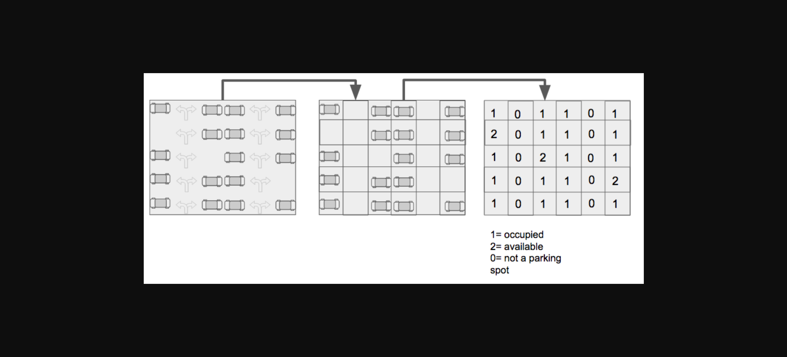

# `15.2` Parking Lot

We can use a 2 dimensional list (matrix) to represent the current state of a parking lot like this:



```py
parking_state = [
  [1,0,1,1,0,1],
  [2,0,1,1,0,1],
  [1,0,2,1,0,1],
  [1,0,1,1,0,1],
  [1,0,1,1,0,2],
  [1,0,1,1,0,1],
]
```

## 📝 Instructions:

1. Create a function `get_parking_lot()` that returns a dictionary with `total_slots`, `available_slots` and `occupied_slots` like the following:

```python

state = {
     total_slots: 12,
     available_slots: 3,
     occupied_slots: 9
}
```

## 💡 Hints:

- Declare the key names to store the values.

- You have to do a nested loop.

- Compare the statements.
